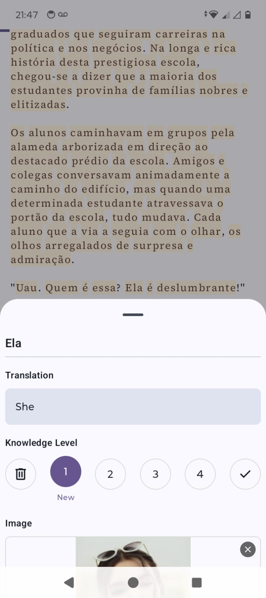

# Light Novel Reader (WIP) 

An open-source Android app for reading and managing light novels.

This app is being developed using **Kotlin**, **Jetpack Compose**, and follows **MVI architecture** with clean principles.

> Project still under development  

## Features (Current MVP)

- Language support (`en`, `pt-BR`, `ja`, `de`)
- Highlight individual words in chapter text based on learning progress
- Add an image for a specific word while reading

## Disclaimer

The developer of this application does not have any affiliation with the content providers available.

## Screenshots :camera:

| Views       | Dark                                                                 | Light                                                                 |
| ----------- | -------------------------------------------------------------------- | --------------------------------------------------------------------- |
| Library     |                   |                   |
| Book        |                  |                  |
| Reader      |                |                |
| Save words  |              |              |

## Tech Stack

| Layer       | Technology             |
|-------------|-------------------------|
| UI          | Jetpack Compose         |
| State       | Kotlin Flows + MVI      |
| Local DB    | Room                    |
| Networking  | Kotlinx Serialization   |
| DI          | Koin                    |
| Architecture| Clean (Domain/Data/UI)  |

## Getting Started

1. Clone the repo
2. Open in Android Studio
3. Create a `local.properties` file in the project root and add your Supabase keys:
   
   - `SUPABASE_URL=https://your-project.supabase.co`
   - `SUPABASE_ANON_KEY=your-anon-key`
5. Run on an emulator or device

## Note

This is a personal/experimental project. Contributions are welcome, but the codebase is evolving quickly.

## License

Licensed under the [MIT License](./LICENSE).

